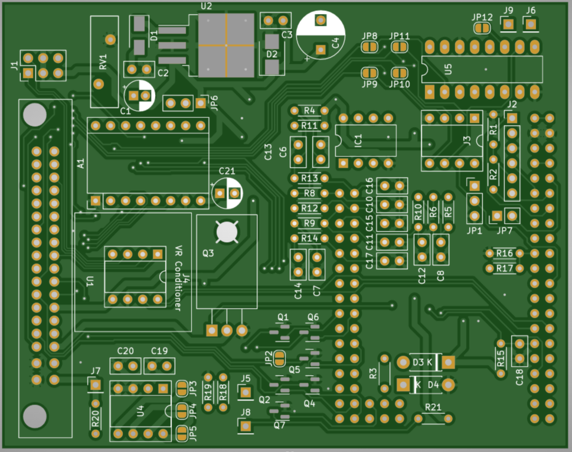

# klxecu

Speeduino based ECM for the fuel injected KLX 250 and 300. Firmware compatible with the Speeduino 0.4.4c. It has only one fuel and ignition channel, but adds a few extra features, namely:

- control of the check engine/temperature warning lights on the dashboard
- control of the secondary throttle plate in the intake (we'll abuse the open loop idle control built in to the speeduino)
- control of the bike's safety switches (tbd, might just use some logic gates. currently a DIP8 socket is available on the board for testing)
- auxiliary "self diag" pin connected to the speeduino processor

This project borrows from the following:

- [NO2C Speeduino - https://github.com/turboedge/SpeedyBoards](https://github.com/turboedge/SpeedyBoards) for parts of the board design
- [Speeduino Hardware - https://github.com/speeduino/Hardware](https://github.com/speeduino/Hardware) for the VR conditioner and other bits of the board design
- [Speeduino Firmware - https://github.com/noisymime/speeduino](https://github.com/noisymime/speeduino) for the ECM firmware
